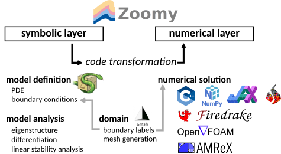

# Zoomy

Flexible modeling and simulation software for free-surface flows.



Zoomy's main objective is to provide a convenient modeling interface for complex free-surface flow models. Zoomy transitions from a **symbolic** modeling layer to **numerical** layer, compatible with a multitude of numerical solvers, e.g. Numpy, Jax, Firedrake, FenicsX, OpenFOAM and AMReX. Additionally, we support the PreCICE coupling framework in many of our numerical implementations, to allow for a convenient integration of our solver with your existing code.

## Documentation

See our [Documentation](https://mbd-rwth.github.io/Zoomy/) for details on

-   how to get started
-   tutorials
-   examples
-   API
-   ...

## License

The Zoomy code is free open-source software, licensed under version 3 or later of the GNU General Public License. See the file [LICENSE](LICENSE) for full copying permissions.

## BibTex Citation

T.b.d.

## Installation

ZoomyLab consists of a 

* Base repository (Zoomy): Symbolic Layer (Models), Pre/Postprocessing, NumPy solver
* Solver backends, each with it's own (sub-)repository
    * JAX (zoomy_jax)
    * Firedrake (zoomy_firedrake)
    * FenicsX (zoomy_fenicsx)
    * AMReX (zoomy_amrex)
* Utility backend
    * meshes (currently GMSH mesh definition files)
    * data (data repository for large scale test cases)

### Getting started in seconds

A good way to have an **interactive** first impression of Zoomy is to use one of the following options

#### JupyterLite

WIP

#### Cloud-based GUI

WIP

### Cloning the repository

You can either clone the repo with all related subrepositories via

```
git clone --recurse-submodules https://github.com/ZoomyLab/Zoomy.git
```

**or** you can start by cloning the main repository (Zoomy) and selected subrepositories, e.g.

```
git clone https://github.com/zoomy-lab/Zoomy.git
cd Zoomy
git submodule update --init meshes
git submodule update --init library/zoomy_core
git submodule update --init library/zoomy_jax
```

The different subrepositories are listed at [ZoomyLab](https://github.com/zoomy-lab)


### Devcontainers / Usage directly in VS-Code

Clone the repository (see above) and open the repository in your IDE / VS-Code. A pop-up will appear if you want to open the workspace in a container. You can choose between:

* Zoomy + Jax
* Zoomy + Firedrake

**Requirements**:
* Docker installation
* 'Dev Container' extension in VS-Code

**Restrictions**:
* On Windows, you need to use Linux Containers for Docker. This requires the usage of WSL.


### Docker images

We offer Docker containers for

* Zoomy + JAX: `docker pull docker push ghcr.io/zoomylab/zoomy_jax:latest`
* Zoomy + Firedrake: `docker pull docker push ghcr.io/zoomylab/zoomy_firedrake:latest`

**Restrictions**:
* On Windows, you need to use Linux Containers for Docker. This requires the usage of WSL.

### Conda / Mamba / Micromamba installation

1. Clone the repository (see above)
2. Install Zoomy and the respective solver backends, e.g.

* Zoomy (Numpy solver backend + GMSH support): 

```
conda env create -f install/Zoomy.yml
conda activate zoomy
conda env update -f install/meshes.yml
python3 -m pip install library/zoomy_core
```

* Zoomy + JAX (Numpy + JAX solver backend + GMSH support)

```
conda env create -f install/Zoomy.yml
conda activate zoomy
conda env update -f install/zoomy_jax.yml
conda env update -f install/meshes.yml
python3 -m pip install library/zoomy_core
python3 -m pip install library/zoomy_jax
```


### Advanced

#### AMReX

Note that the AMReX installation is *completely indepdenent* and the AMReX solver does not depend on the Conda/Mamba environment. Follow the instructions on the [AMReX Webpage](https://amrex-codes.github.io/amrex/docs_html/Introduction.html)

WIP 

#### OpenFOAM 12 (Linux / Mac)

WIP

#### PreCICE

WIP


#### Manual installation


See the `install/*.yml` for a complete list of requirements. 

TODO: complete list of dependencies

#### Environment variables

The following environment variables can be set 

```{bash}
ZOOMY_DIR=/path/to/Zoomy 
JAX_ENABLE_X64=True
PETSC_DIR=/path/to/petsc/installation
PETSC_ARCH=architecture used for compiling petsc
```

## Testing

WIP

## Publications

WIP

## Dependencies and acknowledgements

WIP
