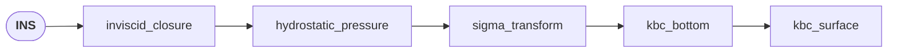

# SystemModel — the frozen operator contract

A `SystemModel` is the **operator-form snapshot** of a `Model`, holding the
matrices solvers consume in the canonical form

$$
M(Q)\,\partial_t Q \;+\; \nabla\!\cdot\!\big(F(Q) + P(Q)\big)
\;+\; \sum_d B(Q)[:,:,d]\,\partial_d Q \;-\; S(Q) \;=\; 0.
$$

`Model` and `SystemModel` are **siblings**, not inherited. `Model` owns the
derivation tree; `SystemModel` owns the operator surface.
`SystemModel.from_model(m)` walks the model's operator API once, freezes the
matrices, and from then on carries only the post-freeze `apply` log. See
[`model.md`](model.md) for derivations, [`numerics.md`](numerics.md) for
tag-routed solver operators, [`../backends/numpy.md`](../backends/numpy.md) for
the consuming runtime.

## Operator slots

`from zoomy_core.systemmodel import SystemModel`

| Field                          | Shape                              | Meaning                              |
| ------------------------------ | ---------------------------------- | ------------------------------------ |
| `mass_matrix`                  | `(n_eq, n_state)`                  | $M(Q)$, canonical $= I$              |
| `flux`                         | `(n_eq, n_dim)`                    | $F(Q)$, conservative                 |
| `hydrostatic_pressure`         | `(n_eq, n_dim)`                    | $P(Q)$, split off $F$                |
| `nonconservative_matrix`       | `(n_eq, n_state, n_dim)`           | $B(Q)$ in $B\,\partial_x Q$          |
| `source` / `source_explicit`   | `(n_eq, 1)`                        | $S$, implicit / explicit             |
| `diffusion_matrix[_explicit]`  | `(n_eq, n_state, n_dim, n_dim)`    | $A$ in $\nabla\!\cdot(A\!:\!\nabla Q)$ |
| `quasilinear_matrix` *(derived)* | `(n_eq, n_state, n_dim)`         | $\partial F/\partial Q + \partial P/\partial Q + B$ |
| `source_jacobian` *(derived)*  | `(n_eq, n_state)`                  | $\partial S/\partial Q$              |
| `eigenvalues` *(derived)*      | `(n_eq, 1)` or `None`              | spectrum of $\sum_d n_d A^{(d)}_{ql}$; `None` ⇒ runtime numerical wavespeed |

`time`, `space` are sympy Symbols; `state`, `aux_state` are lists; `parameters`,
`parameter_values` are `Zstruct` (dot-access). `equation_to_state_index` records
which state slot each row updates — identity for square systems, non-identity
for splitter sub-systems. Derived operators auto-recompute on every mutation.

## Freeze — `SystemModel.from_model(m)`

`from_model` calls each operator method on the source model and freezes the
result. Boundary kernels (`_boundary_conditions`, `_aux_boundary_conditions`,
`_boundary_gradients`) and initial-condition callbacks ride along verbatim.
`__post_init__` computes `quasilinear_matrix` and `source_jacobian`;
`eigenvalues` is carried over (`None` ⇒ runtime numerical wavespeed).

`from_model` then calls `expose_aux_atoms()`, which scans every operator entry
and replaces every undeclared `Function` or `Derivative` atom by an aux
`Symbol`. The mapping lands in `sm.aux_registry` as a list of dicts with keys
`kind` (`"function" | "derivative" | "limited_derivative"`), `name`, `row`,
`atom`, `aux_symbol`; derivative entries additionally carry `target_name`,
`target_kind` (`"state" | "function" | "unknown"`), `multi_index` (spatial
orders per axis, matching `LSQMesh.compute_derivatives`), and optional
`state_index` / `function_row` / `limiter_scheme`. Time derivatives are
skipped — they live in `mass_matrix`. `state` is the model author's
declaration; `aux_state` starts from the source `Model` and grows here. After
`from_model`, solvers walk `aux_registry`, never re-scan operator matrices.

## Solver tags — the routing contract

Every non-zero piece of the derivation is routed to an operator slot by a
**solver tag** the model author writes on each `Expression`. There is no
*solver-tag* auto-router — the derivation-time `AutoTag` op
([model.md](model.md)) assigns *physics categories*, but the final
`Expression → slot` routing is explicit, and untagged sub-expressions silently
return zero. Canonical tags
(`library/zoomy_core/zoomy_core/model/derivation/tag_catalog.py`) and the fixed
`SOLVER_TAG_TO_SLOT` routing:

| Tag                       | SystemModel slot               |
| ------------------------- | ------------------------------ |
| `flux`                    | `flux`                         |
| `nonconservative_flux`    | `nonconservative_matrix`       |
| `hydrostatic_pressure`    | `hydrostatic_pressure`         |
| `time_derivative`         | `mass_matrix`                  |
| `implicit_source`         | `source`                       |
| `explicit_source`         | `source_explicit`              |
| `implicit_diffusion`      | `diffusion_matrix`             |
| `explicit_diffusion`      | `diffusion_matrix_explicit`    |

Tagging happens on the `Expression`:

```python
xmom = xmom.solver_tag(
    flux                 = F_x,
    hydrostatic_pressure = P_x,
    implicit_source      = manning_friction,
    explicit_source      = gravity_body_force,
)
```

Aliases (`convective` → `flux`, `ncp` → `nonconservative_flux`,
`source_implicit` → `implicit_source`, ...) re-order words; they do not
translate physics names. Canonical mass-matrix form is **`M = I`**: the source
`Model` closes with `InvertMassMatrix`; solvers refuse non-canonical mass
matrices outside the DAE path.

## Post-freeze operations

`SystemModel.apply(operation, *, name=None, description=None)` is the same
mechanism as `Model.apply` — see [`model.md`](model.md). Operations that act
on a *frozen* `SystemModel` live in
`library/zoomy_core/zoomy_core/systemmodel/system_model.py`:

- **`InvertMassMatrix`** — divides each evolution row by its diagonal `M_ii`;
  precondition checked via `assert_diagonal_mass_matrix()`. Post: `M = I` on
  evolution rows.
- **`RemoveNonDiagonalH`** — substitutes the mass equation into rows whose
  `M[:, h]` column is non-zero, pushing the `M[i, h] ∂_t h` cross-term into
  `B` and `S`; clears `M[:, h]` on affected rows.
- **`HydrostaticReconstruction`** — repackages chain-derived
  $g\,h\,\partial_x \eta$ from `(P, B)` into standard SWE $P = g\,h^2/2$ for
  Audusse Riemann solvers. Drops $-g\,h\,b_x$; HR fluctuation supplies it at
  runtime.

## Kinematic boundary conditions

`KinematicBC(state, interface, *, at=None, mass_flux=None, name=None, description=None)`
from `library/zoomy_core/zoomy_core/model/operations.py` is the
single entry point for moving-interface kinematic BCs (applied during the
upstream `Model` / `System` derivation). `at` defaults to `interface`; set it
for σ-transformed systems and per-layer ML σ values. `mass_flux=None` is
impermeable; a sympy expression adds `mass_flux / ρ` to the RHS.

```python
from zoomy_core.model.operations import KinematicBC

sys.apply(KinematicBC(state, state.b,   at=sp.S.Zero))     # post-σ bottom
sys.apply(KinematicBC(state, state.eta, at=sp.S.One))      # post-σ surface
sys.apply(KinematicBC(state, z_k, at=0, mass_flux=m_k))    # ML interface
```

## State change of variables and describe

```python
sm.change_state_variables(new_state, transform)
sm.refresh_derived_operators(eigenvalues=False)
sm.describe()             # compact: n_eq, state, parameters, op log
sm.describe(full=True)    # adds canonical form + every matrix as LaTeX
```

`transform` maps each *old* state Symbol being replaced to its expression in
the *new* state (identity entries omitted). With
$J[i, j] = \partial T_i / \partial Q_{\mathrm{new}, j}$, the operators update
as $F_\mathrm{new} = F_\mathrm{old}(T)$,
$B_\mathrm{new}[i,k,d] = \sum_j B_\mathrm{old}[i,j,d](T)\,J[j,k]$,
$M_\mathrm{new} = M_\mathrm{old}(T)\,J$. Aux-registry entries targeting
replaced state variables are chain-rule propagated. Pass `eigenvalues=True`
only when the spectrum was symbolic and the CoV alters characteristic
structure. `SystemModelDescription` renders via `_repr_markdown_` in Jupyter
and `str(...)` to plain text.

## Visualizing the derivation

The derivation log lives on the upstream `System` — the equation tree the
`Model` walked before `from_model`. `sys.history_mermaid()` renders one;
`combined_history_mermaid(*systems)` from
`zoomy_core.model.models.derived_system` renders multiple side-by-side,
auto-merging identical history prefixes and forking explicit
`System.branch(...)` chains at the parent's `branch_point` node. Both return a
`MermaidDiagram` whose `_repr_markdown_` emits a fenced ```` ```mermaid ````
block. Post-freeze `SystemModel.apply(op)` calls append `{"name", "description"}`
dicts to `sm.history`; the pre-freeze graph is not regenerated from the
SystemModel.

The block below is captured verbatim from `sys_ns.history_mermaid()` after the
Kowalski σ-transform sequence (inviscid closure → hydrostatic pressure →
`SigmaTransform` → bottom and surface `KinematicBC`) from
`thesis/notebooks/modeling/transparent_derivations/kowalski_sigma_transform.ipynb`:



(The trailing `+ h(t, x)` terms inside each derivative are the surface height:
read the surface condition as `w|_{surface} = ∂_t(b+h) + u·∂_x(b+h)`.)

## Standalone use — analysis without a solver

A `SystemModel` is useful on its own: it is the natural input to **linear
stability and dispersion analysis**, because it already carries `M`, the
quasilinear matrix, and the source Jacobian symbolically. The tools in
`zoomy_core/analysis/` take a `SystemModel` directly — no mesh, no runtime:

```python
from zoomy_core.systemmodel import SystemModel
from zoomy_core.analysis import (
    linearise, symbolic_eigenvalues_at,
    extract_quasilinear_pencil, sample_hyperbolicity,
)

sm   = SystemModel.from_model(MyModel())
evs  = symbolic_eigenvalues_at(sm, {h: h0, q: q0}, axis=0)   # symbolic λ(state)

sm_lin           = linearise(sm, {h: 1.0, q: 0.0})           # Q = Q0 + ε δQ
M_t, M_xa, _     = extract_quasilinear_pencil(sm_lin)        # pencil (M_x − λ M_t)
report           = sample_hyperbolicity(M_xa[0], M_t, {h0: (0.1, 5.0)}, n_samples=2000)
print(report.summary())
```

- `linearise(sm, base_state)` (`analysis/linearisation.py`) inserts
  `Q = Q₀ + ε δQ` and returns a new `SystemModel` in the perturbation fields.
- `plane_wave_dispersion(linear_sm, k=…, omega=…, axis=…)` (`analysis/plane_wave.py`)
  solves `det M(ω,k) = 0` for the dispersion relation.
- `extract_quasilinear_pencil` / `generalised_eigenvalues` /
  `sample_generalised_eigenvalues` (`analysis/pencil.py`) give the symbolic and
  numerical spectrum of the pencil `det(M_x − λ M_t) = 0`.
- `is_hyperbolic_at` / `sample_hyperbolicity` (`analysis/hyperbolicity.py`) sweep
  a parameter box and return a `HyperbolicityReport` — the standard check before
  trusting a derived model in a hyperbolic solver.

## Splitting a SystemModel — the VAM pressure projection

A rectangular `SystemModel` (more equations than evolved state, with
`equation_to_state_index` recording the row→slot map) can be **split** into
sub-systems that different discretisations consume. This is how the
non-hydrostatic VAM chain is solved: `model/splitter.py` separates the monolithic
system into a *predictor*, an *elliptic pressure block*, and a *corrector*.

```python
from zoomy_core.model.splitter import split_for_pressure
result = split_for_pressure(sm, pressure_vars=["P_0", "P_1"], dt=dt)
sm_pred, sm_press, sm_corr = result.predictor, result.pressure, result.corrector
```

The structural variant `split_for_pressure_structural(sm, pressure_vars, dt)`
detects each **constraint row** as an identically-zero `mass_matrix` row → the
elliptic block; evolution rows carrying pressure terms get the corrector update
`Q[s] ← Q[s] − dt·(pressure part)/M[row,s]`. Each sub-system is itself a
`SystemModel`, so the same printers and the `ChorinSplitVAMSolver`
([numpy.md](../backends/numpy.md)) consume them unchanged.

## Authoring checklist

Before handing a `SystemModel` to a solver:

- Every non-zero sub-expression routed to a solver tag — `untagged_remainder()`
  on each leaf is zero.
- Canonical mass matrix: `InvertMassMatrix` applied;
  `assert_diagonal_mass_matrix()` passes; `mass_matrix == I` on evolution rows.
- `expose_aux_atoms()` has run (it does, inside `from_model`).
- `state` declared; `parameters` carry positivity / realness declarations from
  the source `Model`; `parameter_values` has a default for every parameter.
- After any `change_state_variables`, `refresh_derived_operators(eigenvalues=...)` has run.
