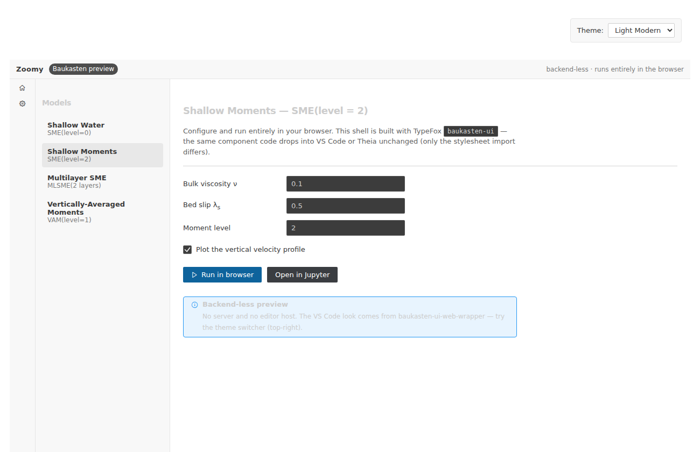

# Baukasten GUI preview (experiment)

```{warning}
This is a **work-in-progress experiment**, not the Zoomy GUI. It exists to
assess whether we could rebuild the GUI on TypeFox's
[Baukasten](https://www.typefox.io/blog/baukasten-announcement/) UI toolkit.
Nothing here is wired to a solver yet — it is a static shell.
```

**[▶ Open the preview](baukasten-preview/index.html)** — runs entirely in your
browser (try the theme switcher, top-right).



## What this is

A small React shell built with `baukasten-ui`, compiled by Vite to **static
files** and served straight from this site — **no backend, no editor host**. The
VS Code look comes from `baukasten-ui-web-wrapper`, which supplies the
`--vscode-*` CSS variables and a theme switcher in a plain browser.

## Why it matters

The current GUI is hand-written vanilla JS with its own widgets. Baukasten is a
different path to the same goal — a *backend-less* GUI — with two properties the
current one lacks:

- **VS Code / Theia portability for free.** The *same component code* runs in a
  plain web page, a VS Code webview, Eclipse Theia and Electron; only the
  stylesheet import changes (`baukasten-web.css` → `baukasten-vscode.css` /
  `baukasten-theia.css`). So a GUI built this way could later live *inside* a
  backend-less Theia/VS Code shell — with real editors, a file tree and Jupyter
  notebooks handled by the host instead of us reimplementing them.
- **A maintained, theme-aware component set** (tables, trees, split panes,
  menus, forms — 90 exports), MIT-licensed. It was created to replace VS Code's
  Webview UI Toolkit, which Microsoft deprecated on 2025-01-01.

## Assessment (2026-07-24)

- **No stripped-down Theia was found** in the repos or Zoomy's git history — the
  earlier browser-only-Theia work is not on this machine.
- **Baukasten does *not* need a backend.** Its "web" target explicitly runs with
  "no editor host present". A minimal app builds to ~170 kB gzipped of static
  assets and renders as shown above.
- **It looks like VS Code** out of the box and ships several theme presets.
- Building the full GUI on it is a real project (porting every card/panel to
  React + Baukasten), but the foundation is sound and low-risk: MIT, static,
  host-portable.

Source: `apps/baukasten-preview/` — a standard Vite + React app
(`npm install && npm run build`). CI builds it non-blocking and copies it to
`/baukasten-preview/`.
