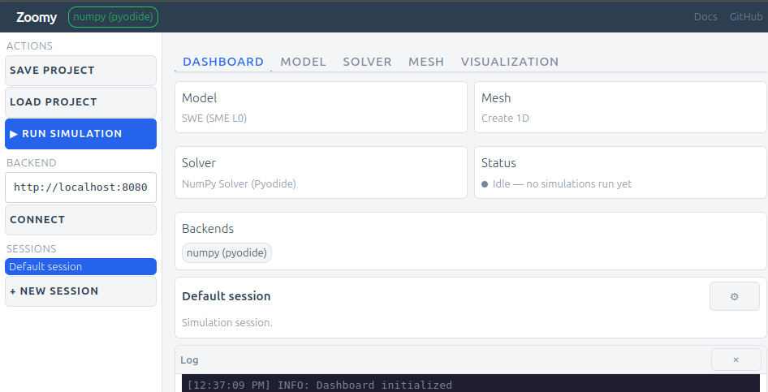
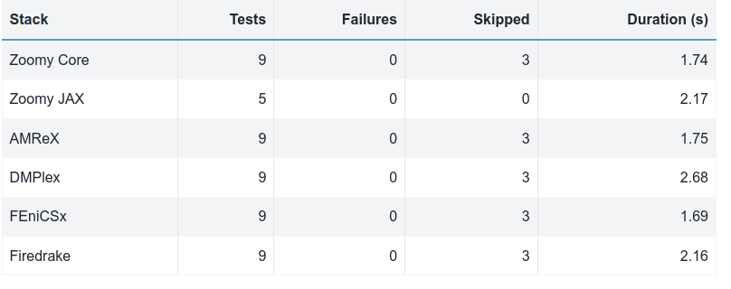

# Zoomy

Zoomy is a flexible modeling and simulation software for free-surface flows.

Zoomy's main objective is to provide a convenient modeling interface for complex free-surface flow models. Zoomy transitions from a **symbolic** modeling layer to **numerical** layer, compatible with a multitude of numerical solvers, e.g. Numpy, Jax, Firedrake, FenicsX, OpenFOAM and AMReX. Additionally, we work to support the PreCICE coupling framework in some numerical implementations, to allow for a convenient integration of our solver with your existing code.

## Explore Zoomy

::::{grid} 3
:gutter: 3

:::{grid-item-card} Open the GUI
:link: gui/index.html
:link-type: url

Configure simulations, run in the browser, and share via URL. No installation required.
:::

:::{grid-item-card} Play the SWE Game
:link: playground/swe-game/index.html
:link-type: url

Sketch your own irrigation system, open the gate and fill the gardens — a shallow-water-equation game running entirely in your browser.
:::

:::{grid-item-card} Testing and CI Reports
:link: ci-reports.html
:link-type: url

Review testing policy, marker model, and generated CI summaries.
:::

::::
