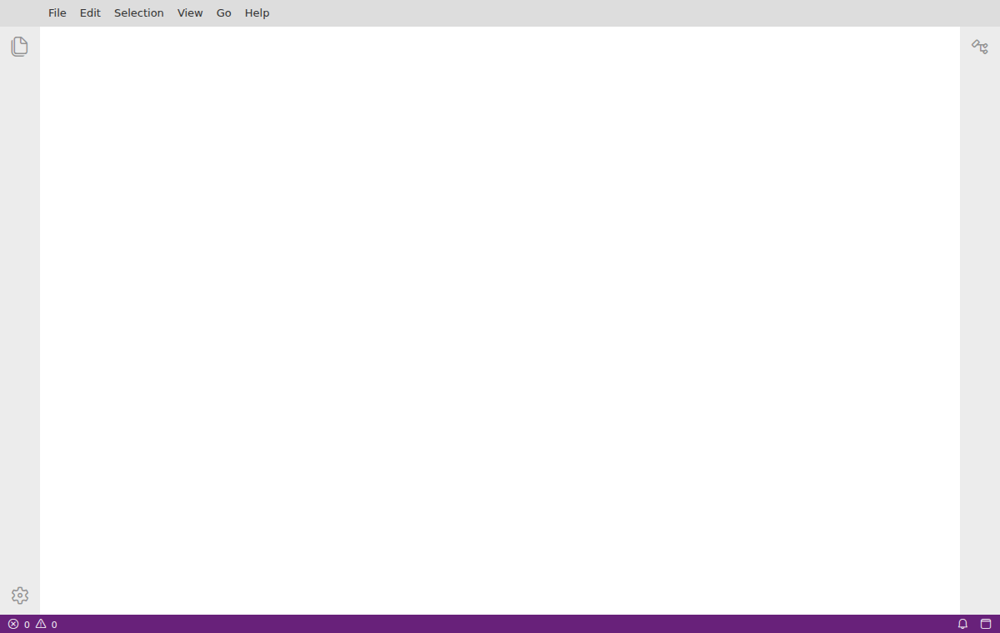

# Using the GUI

The Zoomy GUI is a static web application — no install, no server.

::::{grid} 2
:gutter: 3

:::{grid-item-card} Open the GUI
:link: gui/index.html
:link-type: url
Launch the Zoomy GUI in your browser.
:::
::::

It opens on a clean, full-window GUI (the VS Code chrome — menus, activity bar,
tabs — is hidden until you edit code). First load is a large download (the shell
is heavy) and the in-browser kernel warms `zoomy-core` in the background — give
it a moment.



## What it is

A card-based GUI for composing and running a free-surface-flow case:

- **Compose** — pick a **Model**, **Mesh**, **Solver** (and optionally a
  **Volume of Fluid** participant and **Visualization** viewers) from cards
  grouped into sub-tabs. A parameters panel edits each card's inputs, the model
  equations render inline (KaTeX), and the mesh previews live.
- **Run in the browser** — the built-in **NumPy** solver runs on an in-browser
  **Pyodide kernel** (off the main thread, with jedi autocomplete). No install,
  no server.
- **Run on a backend** — connect an external `zoomy-server` (numpy / jax / amrex
  / dmplex / foam) and the composed case is submitted and solved remotely; the
  result store comes back for visualization. NumPy-in-browser is always
  available; other tags light up when you connect a matching backend.
- **It's just a case** — every GUI action edits one canonical `case.py`
  (`## Model / ## Mesh / ## Solver settings / ## Run`), which round-trips to a
  Jupyter notebook and exports as `.py` / `.ipynb`. *Edit* jumps to the right
  section; edit mode adds or removes cards.

## Rich output in cells

Cells render rich output — text, matplotlib figures, LaTeX equations — through
the host kernel's `display`. Case code should not hand-roll a fallback for this;
call {func}`zoomy_core.misc.show.show`, which renders through whatever the host
provides and degrades to plain text under a bare `python case.py`:

```python
from zoomy_core.misc.show import show

show(model.describe())                    # any object
show(eq=(sympy.Symbol("h^*"), h_expr))    # a rendered equation
show(fig)                                 # a matplotlib figure
```

A local `display = lambda *a: None` shim is the failure mode to avoid: it
silently swallows the figure while the run still looks successful.

## How it's built

Eclipse Theia's **`browser-only`** target builds the whole IDE frontend to
**static files** — no Node backend, no plugin host. A small **native Theia
extension** (`zoomy-theia-ext`) registers everything the standard way: the
card GUI view, a native notebook + in-browser Pyodide `NotebookKernel`, and a
DOM output surface for text, matplotlib and rich `describe()` output. The kernel
reuses the Zoomy GUI "brain" (`zoomy_cli`) for the card catalog, case
composition, param extraction and backend submission.

The goal is **one GUI, three targets** — the same code on the **web** (this
backend-less build), as a **VS Code / Theia extension** (local), and as a
**Theia Electron app** (desktop), changing only the host and one stylesheet.

## Connecting your own backend

The page is served over HTTPS, but browsers exempt `http://localhost` from
mixed-content blocking, so a `zoomy-server` container on **your own machine**
(`:8080`) can be connected with no tunnel or certificate — run the container and
connect. For a backend on another machine, forward it to localhost
(`ssh -L 8080:localhost:8080 …`) or expose it over HTTPS (e.g. Tailscale Serve).

Source: `library/zoomy_gui/` — a `@theia/cli` browser-only app plus the
`zoomy-theia-ext/` native extension and the `gui/` brain. CI builds it and
serves it at `/gui/`.
