**SMEModel** (continuity, x_momentum) — solver-ready

```mermaid
graph TD
    P["**INSModel**<br/>continuity: $$\frac{\partial}{\partial x} u{\left(t,x,z \right)} + \frac{\partial}{\partial z} w{\left(t,x,z \right)} = 0$$<br/>x_momentum: $$\frac{\partial}{\partial z} u{\left(t,x,z \right)} w{\left(t,x,z \right)} + \frac{\partial}{\partial t} u{\left(t,x,z \right)} + \frac{\partial}{\partial x} u^{2}{\left(t,x,z \right)} - \frac{\frac{\partial}{\partial x} \tau_{xx}{\left(t,x,z \right)} + \frac{\partial}{\partial z} \tau_{xz}{\left(t,x,z \right)}}{\rho} + \frac{\frac{\partial}{\partial x} p{\left(t,x,z \right)}}{\rho} = 0$$"]
    P -->|"hydrostatic_pressure<br/>$$\begin{aligned} p{\left(t,x,z \right)} = g \rho \left(- z + H{\left(t,x \right)} + b{\left(t,x \right)}\right) + p_{atm}{\left(t,x \right)} \end{aligned}$$<br/>Newtonian<br/>$$\begin{aligned} \tau_{xx}{\left(t,x,z \right)} = 2 \nu \rho \frac{\partial}{\partial x} u{\left(t,x,z \right)} \\ \tau_{xz}{\left(t,x,z \right)} = \nu \rho \left(\frac{\partial}{\partial z} u{\left(t,x,z \right)} + \frac{\partial}{\partial x} w{\left(t,x,z \right)}\right) \\ \tau_{zx}{\left(t,x,z \right)} = \nu \rho \left(\frac{\partial}{\partial z} u{\left(t,x,z \right)} + \frac{\partial}{\partial x} w{\left(t,x,z \right)}\right) \\ \tau_{zz}{\left(t,x,z \right)} = 2 \nu \rho \frac{\partial}{\partial z} w{\left(t,x,z \right)} \end{aligned}$$<br/>depth integrate + kinematic BCs<br/>$$depth integrate + kinematic BCs$$"| S["**SMEModel**<br/>continuity: $$\frac{\partial}{\partial t} H{\left(t,x \right)} + \frac{\partial}{\partial x} \int\limits_{b{\left(t,x \right)}}^{H{\left(t,x \right)} + b{\left(t,x \right)}} u{\left(t,x,z \right)}\, dz = 0$$<br/>x_momentum: $$2 \nu \left(\frac{\partial}{\partial x} H{\left(t,x \right)} + \frac{\partial}{\partial x} b{\left(t,x \right)}\right) \left. \frac{\partial}{\partial x} u{\left(t,x,z \right)} \right|_{\substack{ z=H{\left(t,x \right)} + b{\left(t,x \right)} }} - 2 \nu \frac{\partial}{\partial x} b{\left(t,x \right)} \left. \frac{\partial}{\partial x} u{\left(t,x,z \right)} \right|_{\substack{ z=b{\left(t,x \right)} }} - \left(u{\left(t,x,b{\left(t,x \right)} \right)} \frac{\partial}{\partial x} b{\left(t,x \right)} + \frac{\partial}{\partial t} b{\left(t,x \right)}\right) u{\left(t,x,b{\left(t,x \right)} \right)} - \left(\frac{\partial}{\partial t} H{\left(t,x \right)} + \frac{\partial}{\partial t} b{\left(t,x \right)}\right) u{\left(t,x,H{\left(t,x \right)} + b{\left(t,x \right)} \right)} - \left(\frac{\partial}{\partial x} H{\left(t,x \right)} + \frac{\partial}{\partial x} b{\left(t,x \right)}\right) u^{2}{\left(t,x,H{\left(t,x \right)} + b{\left(t,x \right)} \right)} + \left(\left(\frac{\partial}{\partial x} H{\left(t,x \right)} + \frac{\partial}{\partial x} b{\left(t,x \right)}\right) u{\left(t,x,H{\left(t,x \right)} + b{\left(t,x \right)} \right)} + \frac{\partial}{\partial t} H{\left(t,x \right)} + \frac{\partial}{\partial t} b{\left(t,x \right)}\right) u{\left(t,x,H{\left(t,x \right)} + b{\left(t,x \right)} \right)} + u^{2}{\left(t,x,b{\left(t,x \right)} \right)} \frac{\partial}{\partial x} b{\left(t,x \right)} + u{\left(t,x,b{\left(t,x \right)} \right)} \frac{\partial}{\partial t} b{\left(t,x \right)} + \frac{\partial}{\partial x} \int\limits_{b{\left(t,x \right)}}^{H{\left(t,x \right)} + b{\left(t,x \right)}} \left(- 2 \nu \frac{\partial}{\partial x} u{\left(t,x,z \right)}\right)\, dz + \frac{\partial}{\partial x} \int\limits_{b{\left(t,x \right)}}^{H{\left(t,x \right)} + b{\left(t,x \right)}} \frac{- g \rho z + g \rho H{\left(t,x \right)} + g \rho b{\left(t,x \right)} + p_{atm}{\left(t,x \right)}}{\rho}\, dz + \frac{\partial}{\partial t} \int\limits_{b{\left(t,x \right)}}^{H{\left(t,x \right)} + b{\left(t,x \right)}} u{\left(t,x,z \right)}\, dz + \frac{\partial}{\partial x} \int\limits_{b{\left(t,x \right)}}^{H{\left(t,x \right)} + b{\left(t,x \right)}} u^{2}{\left(t,x,z \right)}\, dz + \frac{\left(g \rho H{\left(t,x \right)} + p_{atm}{\left(t,x \right)}\right) \frac{\partial}{\partial x} b{\left(t,x \right)}}{\rho} + \frac{\nu \rho \frac{\partial}{\partial b{\left(t,x \right)}} u{\left(t,x,b{\left(t,x \right)} \right)} + \nu \rho \left. \frac{\partial}{\partial x} w{\left(t,x,z \right)} \right|_{\substack{ z=b{\left(t,x \right)} }}}{\rho} - \frac{\nu \rho \left. \frac{\partial}{\partial z} u{\left(t,x,z \right)} \right|_{\substack{ z=H{\left(t,x \right)} + b{\left(t,x \right)} }} + \nu \rho \left. \frac{\partial}{\partial x} w{\left(t,x,z \right)} \right|_{\substack{ z=H{\left(t,x \right)} + b{\left(t,x \right)} }}}{\rho} - \frac{\left(\frac{\partial}{\partial x} H{\left(t,x \right)} + \frac{\partial}{\partial x} b{\left(t,x \right)}\right) \left(- g \rho \left(H{\left(t,x \right)} + b{\left(t,x \right)}\right) + g \rho H{\left(t,x \right)} + g \rho b{\left(t,x \right)} + p_{atm}{\left(t,x \right)}\right)}{\rho} = 0$$"]
```

**Assumptions:** hydrostatic_pressure, Newtonian, depth integrate + kinematic BCs

**continuity:**
$$
\frac{\partial}{\partial t} H{\left(t,x \right)} + \frac{\partial}{\partial x} \int\limits_{b{\left(t,x \right)}}^{H{\left(t,x \right)} + b{\left(t,x \right)}} u{\left(t,x,z \right)}\, dz = 0
$$

**x_momentum:**
$$
2 \nu \left(\frac{\partial}{\partial x} H{\left(t,x \right)} + \frac{\partial}{\partial x} b{\left(t,x \right)}\right) \left. \frac{\partial}{\partial x} u{\left(t,x,z \right)} \right|_{\substack{ z=H{\left(t,x \right)} + b{\left(t,x \right)} }} - 2 \nu \frac{\partial}{\partial x} b{\left(t,x \right)} \left. \frac{\partial}{\partial x} u{\left(t,x,z \right)} \right|_{\substack{ z=b{\left(t,x \right)} }} - \left(u{\left(t,x,b{\left(t,x \right)} \right)} \frac{\partial}{\partial x} b{\left(t,x \right)} + \frac{\partial}{\partial t} b{\left(t,x \right)}\right) u{\left(t,x,b{\left(t,x \right)} \right)} - \left(\frac{\partial}{\partial t} H{\left(t,x \right)} + \frac{\partial}{\partial t} b{\left(t,x \right)}\right) u{\left(t,x,H{\left(t,x \right)} + b{\left(t,x \right)} \right)} - \left(\frac{\partial}{\partial x} H{\left(t,x \right)} + \frac{\partial}{\partial x} b{\left(t,x \right)}\right) u^{2}{\left(t,x,H{\left(t,x \right)} + b{\left(t,x \right)} \right)} + \left(\left(\frac{\partial}{\partial x} H{\left(t,x \right)} + \frac{\partial}{\partial x} b{\left(t,x \right)}\right) u{\left(t,x,H{\left(t,x \right)} + b{\left(t,x \right)} \right)} + \frac{\partial}{\partial t} H{\left(t,x \right)} + \frac{\partial}{\partial t} b{\left(t,x \right)}\right) u{\left(t,x,H{\left(t,x \right)} + b{\left(t,x \right)} \right)} + u^{2}{\left(t,x,b{\left(t,x \right)} \right)} \frac{\partial}{\partial x} b{\left(t,x \right)} + u{\left(t,x,b{\left(t,x \right)} \right)} \frac{\partial}{\partial t} b{\left(t,x \right)} + \frac{\partial}{\partial x} \int\limits_{b{\left(t,x \right)}}^{H{\left(t,x \right)} + b{\left(t,x \right)}} \left(- 2 \nu \frac{\partial}{\partial x} u{\left(t,x,z \right)}\right)\, dz + \frac{\partial}{\partial x} \int\limits_{b{\left(t,x \right)}}^{H{\left(t,x \right)} + b{\left(t,x \right)}} \frac{- g \rho z + g \rho H{\left(t,x \right)} + g \rho b{\left(t,x \right)} + p_{atm}{\left(t,x \right)}}{\rho}\, dz + \frac{\partial}{\partial t} \int\limits_{b{\left(t,x \right)}}^{H{\left(t,x \right)} + b{\left(t,x \right)}} u{\left(t,x,z \right)}\, dz + \frac{\partial}{\partial x} \int\limits_{b{\left(t,x \right)}}^{H{\left(t,x \right)} + b{\left(t,x \right)}} u^{2}{\left(t,x,z \right)}\, dz + \frac{\left(g \rho H{\left(t,x \right)} + p_{atm}{\left(t,x \right)}\right) \frac{\partial}{\partial x} b{\left(t,x \right)}}{\rho} + \frac{\nu \rho \frac{\partial}{\partial b{\left(t,x \right)}} u{\left(t,x,b{\left(t,x \right)} \right)} + \nu \rho \left. \frac{\partial}{\partial x} w{\left(t,x,z \right)} \right|_{\substack{ z=b{\left(t,x \right)} }}}{\rho} - \frac{\nu \rho \left. \frac{\partial}{\partial z} u{\left(t,x,z \right)} \right|_{\substack{ z=H{\left(t,x \right)} + b{\left(t,x \right)} }} + \nu \rho \left. \frac{\partial}{\partial x} w{\left(t,x,z \right)} \right|_{\substack{ z=H{\left(t,x \right)} + b{\left(t,x \right)} }}}{\rho} - \frac{\left(\frac{\partial}{\partial x} H{\left(t,x \right)} + \frac{\partial}{\partial x} b{\left(t,x \right)}\right) \left(- g \rho \left(H{\left(t,x \right)} + b{\left(t,x \right)}\right) + g \rho H{\left(t,x \right)} + g \rho b{\left(t,x \right)} + p_{atm}{\left(t,x \right)}\right)}{\rho} = 0
$$
